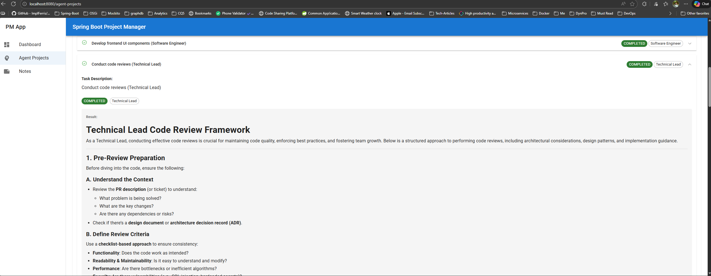
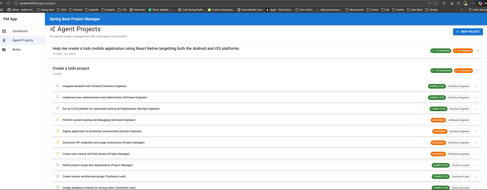
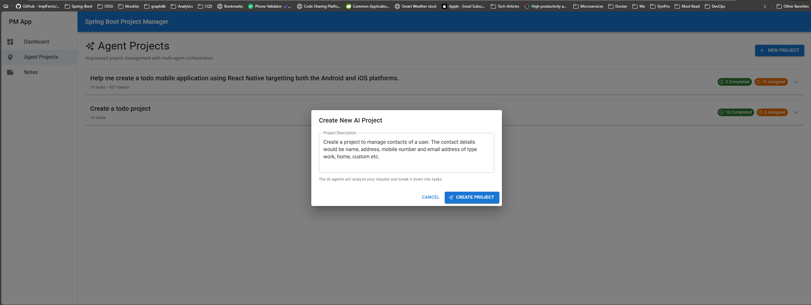

# Spring Boot AI Project Manager

A full-stack **AI-powered project management application** with Spring Boot backend featuring multi-agent orchestration and React TypeScript frontend with real-time streaming capabilities.

## 🎥 Demo Video & Screenshots

### Video Demo

See the AI Project Manager in action! Watch how AI agents collaborate to break down projects, assign tasks, and generate solutions in real-time.

https://github.com/user-attachments/assets/c5885233-8c1c-4fe6-9f65-4cbdf9ab3ee2

> **Note**: Click the video above to see the full demo showcasing:
> - Creating an AI-powered project
> - Multi-agent task delegation
> - Real-time streaming responses
> - Beautiful Markdown rendering
> - Token usage tracking

### Screenshots

**Agent Projects Dashboard - Multi-Agent Collaboration**



*View all AI-powered projects, track tasks, and see which specialist agents are assigned to each task.*

**Real-Time Streaming Execution**



*Watch AI agents work in real-time with buffered streaming, beautiful Markdown rendering, and token usage tracking.*



*To create a new AI-powered project, simply enter your project vision and let the AI agents handle the rest!*

---

## 🌟 Key Features

### AI Multi-Agent System
- **Project Manager Agent** - Analyzes requirements and breaks down projects into tasks
- **Technical Lead Agent** - Defines architecture and technical specifications
- **Software Engineer Agent** - Implements features and writes code
- **DevOps Engineer Agent** - Sets up infrastructure and CI/CD pipelines
- **Intelligent Task Delegation** - Automatic assignment of tasks to appropriate specialists

### Real-Time Streaming
- **Buffered Streaming** - Server-side buffering for 50-100x fewer UI re-renders
- **Live Progress Updates** - Watch AI agents work in real-time
- **Markdown Rendering** - Beautiful formatting of AI responses with code highlighting
- **Configurable Performance** - Tune buffer size and timeout for optimal performance

### Modern UI
- **Material-UI Components** - Professional, responsive design
- **Redux State Management** - Predictable state with Redux-Saga
- **TypeScript** - Full type safety across frontend
- **Markdown Support** - Rich text editor for notes and documentation

### Project Management
- **Multi-Project Support** - Manage multiple AI-powered projects
- **Task Tracking** - View and execute tasks with real-time status updates
- **Token Usage Tracking** - Monitor AI usage per task and project
- **Persistent Storage** - PostgreSQL database with JPA

## 🛠 Technology Stack

### Backend
- **Spring Boot 4.0.2** - Modern Java framework
- **Spring AI** - LLM integration with streaming support
- **PostgreSQL** - Relational database
- **Spring Data JPA** - Database abstraction
- **Spring WebFlux** - Reactive streaming
- **MapStruct** - Entity/VO mapping
- **Lombok** - Boilerplate reduction

### Frontend
- **React 18** - Modern UI library
- **TypeScript** - Type-safe JavaScript
- **Vite** - Lightning-fast build tool
- **Redux + Redux-Saga** - State management with side effects
- **Material-UI (MUI)** - React component library
- **Heroicons** - SVG icon library
- **ReactMarkdown** - Markdown rendering with syntax highlighting
- **Axios** - HTTP client

### AI & LLM
- **LM Studio** - Local LLM server (default)
- **OpenAI Compatible API** - Works with any OpenAI-compatible endpoint
- **Model**: mistralai/devstral-small-2-2512
- **Streaming Support** - Real-time response generation
- **Token Tracking** - Usage monitoring and optimization

## 🚀 Getting Started

### Prerequisites
- **Java 21** - JDK 21 or higher
- **Maven 3.6+** - Build tool
- **PostgreSQL** - Database server
- **Docker** (optional) - For containerized PostgreSQL
- **LM Studio** - For local LLM (or any OpenAI-compatible API)
- Node.js 20+ and Yarn are **automatically installed** by Maven

### Database Setup

#### Option 1: Docker Compose (Recommended)
```bash
# Start PostgreSQL with Docker
docker-compose up -d
```

The compose file is pre-configured with:
- PostgreSQL 16
- Database: `project-db`
- User: `superuser`
- Password: `pa55ward`
- Port: `5432`

#### Option 2: Manual PostgreSQL Setup
```bash
# Create database
createdb project-db

# Update credentials in application.yaml
```

### LLM Setup

#### Option 1: LM Studio (Recommended for Local Development)
1. Download and install [LM Studio](https://lmstudio.ai/)
2. Download the model: `mistralai/devstral-small-2-2512`
3. Start the local server on port `1234`
4. API endpoint: `http://localhost:1234`

#### Option 2: OpenAI or Compatible API
Update `application.yaml`:
```yaml
spring:
  ai:
    openai:
      base-url: https://api.openai.com
      api-key: YOUR_API_KEY
```

### Building the Application

#### Full Build (Backend + Frontend)
```bash
mvn clean install
```

This will:
1. ✅ Install Node.js 20.11.1 and Yarn 1.22.19 (if not present)
2. ✅ Install frontend dependencies
3. ✅ Build the React application with Vite
4. ✅ Compile the Spring Boot application
5. ✅ Run tests
6. ✅ Package everything into a single JAR

#### Quick Build (Skip Tests)
```bash
mvn clean install -DskipTests
```

#### Backend Only (Skip Frontend)
```bash
mvn clean install -DskipTests -Dfrontend.skip=true
```

#### Frontend Only (Development)
```bash
cd src/main/frontend
yarn install
yarn build
```

### Running the Application

#### Production Mode (Single JAR)
```bash
java -jar target/spring-boot-project-manager-0.0.1-SNAPSHOT.jar
```

The application will be available at `http://localhost:8080`

#### Development Mode (Hot Reload)

**Backend:**
```bash
mvn spring-boot:run
```

**Frontend (separate terminal):**
```bash
cd src/main/frontend
yarn dev
```

- Frontend: `http://localhost:3000` (with hot reload)
- Backend API: `http://localhost:8080`

#### Using the Batch Scripts (Windows)

**Build:**
```bash
build.bat
```

**Development Mode:**
```bash
dev.bat
```

**Production Mode:**
```bash
start.bat
```

## 📁 Project Structure

```
spring-boot-project-manager/
├── src/
│   ├── main/
│   │   ├── java/io/subbu/ai/pm/
│   │   │   ├── agents/              # AI Agent implementations
│   │   │   │   ├── ProjectManagerAgent.java
│   │   │   │   ├── TechnicalLeadAgent.java
│   │   │   │   ├── SoftwareEngineerAgent.java
│   │   │   │   └── DevOpsEngineerAgent.java
│   │   │   ├── controllers/rest/    # REST API endpoints
│   │   │   │   └── AgentRestController.java
│   │   │   ├── services/            # Business logic
│   │   │   │   └── AgentOrchestrationService.java
│   │   │   ├── models/              # JPA entities
│   │   │   │   ├── ProjectEntity.java
│   │   │   │   └── TaskEntity.java
│   │   │   ├── repos/               # JPA repositories
│   │   │   ├── mappers/             # MapStruct mappers
│   │   │   ├── vos/                 # Value objects
│   │   │   └── SpringBootProjectManagerApplication.java
│   │   ├── resources/
│   │   │   ├── application.yaml     # Configuration
│   │   │   └── static/              # Frontend build output
│   │   └── frontend/                # React application
│   │       ├── src/
│   │       │   ├── components/      # Reusable components
│   │       │   │   ├── Layout.tsx
│   │       │   │   └── ContentRenderer.tsx
│   │       │   ├── pages/           # Page components
│   │       │   │   ├── Dashboard.tsx
│   │       │   │   ├── AgentProjects.tsx
│   │       │   │   └── Notes.tsx
│   │       │   ├── store/           # Redux store
│   │       │   │   ├── actions/     # Action creators
│   │       │   │   ├── reducers/    # Reducers
│   │       │   │   ├── sagas/       # Redux-Saga effects
│   │       │   │   └── api/         # API clients
│   │       │   ├── App.tsx
│   │       │   └── main.tsx
│   │       ├── package.json
│   │       └── vite.config.ts
│   └── test/
├── docs/                            # Documentation
├── compose.yaml                     # Docker Compose config
├── pom.xml                         # Maven configuration
└── README.md
```

## 🎯 Using the Application

> **💡 New to the app?** Watch the [demo video](#-demo-video) at the top of this README to see the complete workflow in action!

### 1. Create an AI-Powered Project

Navigate to **Agent Projects** and click **New Project**:

```
Example: "Build a todo mobile application"
```

The Project Manager Agent will:
1. Analyze your request
2. Break it down into specific tasks
3. Assign tasks to specialist agents:
   - Technical Lead → Architecture and design
   - Software Engineer → Implementation
   - DevOps Engineer → Infrastructure and deployment

### 2. View Project Tasks

Expand any project to see:
- ✅ Task list with descriptions
- 👤 Assigned specialist agent
- 📊 Task status (ASSIGNED → COMPLETED)
- 🎯 Token usage per task

### 3. Execute Tasks

Click **Execute Task** on any ASSIGNED task to:
- 🔵 Watch real-time streaming (blue box)
- 📝 See AI response with Markdown formatting
- ⏱️ Monitor progress with smooth updates
- ✅ Automatically save results when complete

### 4. Review Results

Completed tasks show:
- ⚪ Final result (gray box)
- 📄 Beautifully formatted Markdown
- 💰 Token count
- ✨ Code blocks with syntax highlighting

## ⚙️ Configuration

### Buffered Streaming Configuration

Edit `src/main/resources/application.yaml`:

```yaml
app:
  streaming:
    buffer-size: 50           # Chunks to buffer (10-200)
    buffer-timeout-ms: 500    # Max wait time (100-2000ms)
```

**Presets**:
- **Responsive**: buffer-size: 10, timeout: 200ms
- **Balanced** (default): buffer-size: 50, timeout: 500ms
- **Efficient**: buffer-size: 100, timeout: 1000ms

### LLM Configuration

```yaml
spring:
  ai:
    openai:
      base-url: http://localhost:1234
      api-key: lm-studio
      chat:
        options:
          temperature: 0.7
          max-tokens: 8192
          model: mistralai/devstral-small-2-2512
          stream-usage: true
```

### Database Configuration

```yaml
spring:
  datasource:
    url: jdbc:postgresql://localhost:5432/project-db
    username: superuser
    password: pa55ward
```

## 🧪 Testing

### Backend Tests
```bash
mvn test
```

### Frontend Tests
```bash
cd src/main/frontend
yarn test
```

### Integration Tests
```bash
mvn verify
```

## 📊 Performance Metrics

### Buffered Streaming Benefits

| Metric | Before | After | Improvement |
|--------|--------|-------|-------------|
| SSE Messages | 1000-2000 | 20-40 | **50-100x fewer** |
| UI Re-renders | 1000-2000 | 20-40 | **50-100x fewer** |
| CPU Usage | High | Low | **Significantly reduced** |
| Battery Life | Poor | Good | **2-3x longer on mobile** |

## 🐛 Troubleshooting

### Application won't start
```bash
# Check database is running
docker-compose ps

# Check LM Studio is running
curl http://localhost:1234/v1/models

# Clear and rebuild
mvn clean install -DskipTests
```

### Frontend build fails
```bash
cd src/main/frontend
rm -rf node_modules yarn.lock
yarn install
yarn build
```

### Database connection errors
```bash
# Recreate database
docker-compose down -v
docker-compose up -d

# Wait for PostgreSQL to be ready
docker-compose logs -f postgres
```

### Streaming not working
1. Check LM Studio is running
2. Verify model is loaded
3. Check `application.yaml` base-url
4. Check browser console for errors

## 📚 Documentation

Comprehensive documentation available in `docs/`:
- `BUFFERED_STREAMING_IMPLEMENTATION.md` - Server-side buffering details
- `FRONTEND_BUFFERED_STREAMING_INTEGRATION.md` - Frontend integration
- `MARKDOWN_RENDERING_FIX.md` - Markdown rendering implementation
- `PROJECT_LIST_ENHANCEMENT.md` - UI improvements
- `STREAMING_DISPLAY_FIXES.md` - Streaming fixes

## 🚢 Deployment

### Building for Production
```bash
mvn clean package -DskipTests
```

This creates: `target/spring-boot-project-manager-0.0.1-SNAPSHOT.jar`

### Running in Production
```bash
java -jar target/spring-boot-project-manager-0.0.1-SNAPSHOT.jar
```

The Spring Boot application serves:
- Backend API at `/api/*`
- Frontend static files at `/*`

### Docker Deployment (Optional)
```bash
# Build JAR
mvn clean package -DskipTests

# Create Dockerfile
# Run with docker-compose
docker-compose up
```

## 🤝 Contributing

1. Fork the repository
2. Create your feature branch (`git checkout -b feature/amazing-feature`)
3. Commit your changes (`git commit -m 'Add amazing feature'`)
4. Push to the branch (`git push origin feature/amazing-feature`)
5. Open a Pull Request

## 📝 License

This project is part of a learning exercise for building AI-powered full-stack applications with Spring Boot and React.

## 🚀 Future Enhancements

We have an exciting roadmap ahead! See the full details in [`docs/FUTURE_ENHANCEMENTS.md`](docs/FUTURE_ENHANCEMENTS.md).

### Top 10 Planned Features

#### 1. 👥 Multi-User Authentication & Collaboration
- OAuth2 login (Google, GitHub)
- Project sharing with team members
- Real-time collaboration with WebSocket
- Comments and discussions on tasks

#### 2. 🤖 Expanded Agent Team
New specialist agents:
- **QA/Test Engineer** - Automated test generation
- **Security Engineer** - Vulnerability detection
- **UX Designer** - Wireframes and mockups
- **Database Architect** - Schema design
- **Product Owner** - User story creation
- **Documentation Writer** - Auto-generate docs

#### 3. 🧠 Multi-Model AI Support
- Use GPT-4 for architecture, Claude for code, Llama for docs
- Automatic model selection based on task complexity
- Cost optimization with model fallbacks
- 40% estimated cost reduction

#### 4. 💻 Code Execution Environment
- Sandboxed Docker containers for running generated code
- Multiple language support (Python, JavaScript, Java)
- Real-time output capture and display
- Security isolation for safe execution

#### 5. 🔌 GitHub Integration
- Auto-create repositories from projects
- Push generated code to GitHub
- Create pull requests automatically
- Sync GitHub issues with tasks

#### 6. ⚡ Performance Enhancements
- Redis caching (10x faster queries)
- Async task processing with job queues
- Database optimization and indexing
- Load balancing for horizontal scaling

#### 7. 🎨 Advanced UI/UX
- Dark mode with custom themes
- Advanced task filtering and search
- Drag-and-drop task reordering
- Real-time browser notifications
- Rich analytics dashboard with charts

#### 8. 📊 Analytics & Cost Management
- Token usage tracking and trends
- Cost forecasting and budgets
- Performance metrics dashboard
- Project velocity analysis
- ROI calculations

#### 9. 🔒 Enterprise Security
- API key management for automation
- Comprehensive audit logging
- Rate limiting and throttling
- SSO integration (SAML, OAuth2)
- Compliance reporting

#### 10. 🤝 External Integrations
- Jira/Trello synchronization
- Slack/Discord notifications
- Plugin system for extensibility
- REST API for custom integrations
- Webhook support

### Quick Wins (Can Implement This Week!)

1. **Dark Mode** (2 hours) - Most requested feature
2. **Task Filtering** (4 hours) - Better task organization
3. **Cost Tracking UI** (3 hours) - Display token costs
4. **Redis Caching** (4 hours) - 10x performance boost
5. **Health Monitoring** (3 hours) - Production readiness
6. **Slack Notifications** (4 hours) - Team awareness
7. **Database Indexes** (1 hour) - 5x faster queries

### 6-Month Roadmap

- **Month 1**: Foundation (Multi-user auth, Dark mode, Caching)
- **Month 2**: Collaboration (Real-time features, Comments)
- **Month 3**: AI Enhancement (New agents, Multi-model)
- **Month 4**: Integration (GitHub, Jira, Plugins)
- **Month 5**: Performance (Async, Load balancing)
- **Month 6**: Analytics (Dashboard, Reporting, PWA)

**Expected Impact**:
- 10x user growth
- 5x projects per user  
- 40% cost reduction
- 99.9% uptime target
- 80%+ user satisfaction

For detailed implementation guides, cost estimates, and technical specifications, see:
- [`docs/FUTURE_ENHANCEMENTS.md`](docs/FUTURE_ENHANCEMENTS.md) - Comprehensive 40+ ideas with code examples
- [`docs/FUTURE_ENHANCEMENTS_SUMMARY.md`](docs/FUTURE_ENHANCEMENTS_SUMMARY.md) - Quick reference guide

## 🙏 Acknowledgments

- Spring AI team for LLM integration
- Material-UI for beautiful components
- LM Studio for local LLM capabilities
- React and Redux communities

## 📞 Support

For issues and questions:
- Create an issue in the repository
- Check existing documentation in `docs/`
- Review troubleshooting section above

---

**Built with ❤️ using Spring Boot, React, and AI**
---

**Built with ❤️ using Spring Boot, React, and AI**
